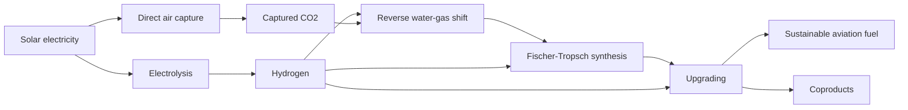
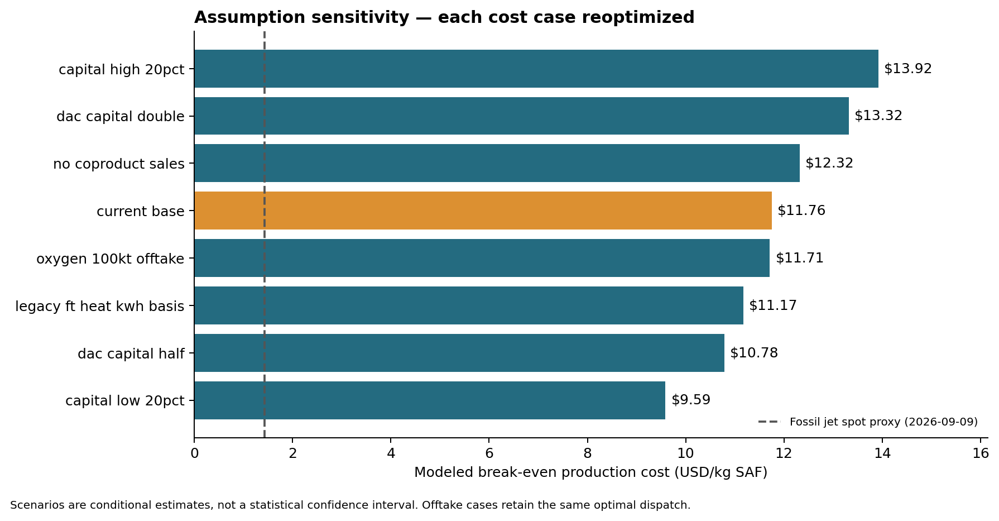

# Solar to Sustainable Aviation Fuel

[](https://github.com/shaurya20335/solar-to-sustainable-aviation-fuel/actions/workflows/tests.yml)

**Techno-economic optimization of a solar-powered sustainable aviation fuel facility in Arizona.**

| Course | Details |
|---|---|
| Institution | NYU Tandon School of Engineering |
| Department | Chemical and Biomolecular Engineering |
| Course codes | **CBE-GY 9413 A / CUSP-GX 9113 A** |
| Course title | **Introduction to Sustainable Energy Systems** |
| Semester | **Fall 2025** |
| Author | [Shaurya Shukla](https://github.com/shaurya20335) |

This course project studies how solar generation, process equipment and storage can be sized and operated to produce **100,000 tonnes of sustainable aviation fuel (SAF) per year**. A linear optimization model connects hourly electricity availability to fuel production and estimates the resulting break-even production cost.

**Analysis vintage:** the course affiliation is Fall 2025; the saved analysis is an updated **September 16, 2026** assessment using **2024 weather** and verified EIA observations dated **September 9, 2026**. These dates describe different parts of the study.

## Start here

- [Final report (PDF)](results/2026-09-16/solar_saf_final_report.pdf)
- [Base-case results and capacities](results/2026-09-16/current_base/scenario_report.md)
- [Sensitivity comparison](results/2026-09-16/scenario_comparison.csv)
- [Model equations](docs/model_equations.md) and [assumptions audit](docs/model_audit.md)
- [Detailed model guide](docs/model_guide.md)
- [Reproducibility and archive interpretation](docs/reproducibility.md)
- [References and source attribution](docs/references.md)

## Process and method



The diagram is a conceptual process overview. Storage, heating and auxiliary loads are defined in the model equations.

The model co-optimizes installed capacity and dispatch across **8,784 hourly intervals**, covering the complete 2024 leap year. Batteries and hydrogen/CO2 storage connect operation across hours. Electricity and material balances, paid auxiliary heating, cyclic inventories, process turndown, ramp limits and the annual fuel target constrain the solution. SciPy's HiGHS solver solves the linear program; no commercial solver license is required.

The objective minimizes annualized equipment and operating costs. Reporting subtracts bounded coproduct revenue to calculate net levelized fuel cost. Base-case oxygen sales and policy credits are zero. The [equations](docs/model_equations.md) define the modeled boundary and units.

## Saved results

| Base-case measure | Result |
|---|---:|
| Annual SAF production | 100,000 tonnes |
| Modeled break-even cost | **$11.76/kg SAF** |
| Cost at the assumed 0.8 kg/L density | $35.60/US gallon |
| Installed capital | $9.65 billion |
| Solar PV capacity | 3.713 GW DC |
| Electrolyzer capacity | 1.162 GW |
| Saved full-year scenarios | 8 |



Sensitivities cover ±20% installed capital, half/double DAC capital, oxygen offtake, no coproduct sales, and an alternative FT heat-unit interpretation. Equipment/heat cases were reoptimized; revenue-only changes reuse the same optimal dispatch. These scenarios are conditional comparisons, not a statistical confidence interval.

The results are **engineering screening estimates**, not observed SAF sale prices or a validated commercial plant budget. They depend on one weather year, perfect foresight, fixed surrogate process coefficients and several unverified cost assumptions. Supplier quotes, reconciled process simulation, plant availability, lifecycle certification and actual offtake agreements remain outside the completed analysis. See the [audit](docs/model_audit.md).

## Installation

Use **Python 3.13**. From a terminal on macOS or Linux:

```bash
git clone https://github.com/shaurya20335/solar-to-sustainable-aviation-fuel.git
cd solar-to-sustainable-aviation-fuel
python3.13 -m venv .venv
.venv/bin/python -m pip install -r requirements.txt
```

On Windows, create the environment with `py -3.13 -m venv .venv` and replace `.venv/bin/python` below with `.venv\Scripts\python.exe`.

The weather input is included as a **lossless compressed CSV** and is read directly. No manual download, extraction, API key or Git LFS setup is required to reproduce the saved configuration. [Weather provenance and checksums](data/weather/README.md) document its identity.

## Run and validate

Run the regression tests, then an optional one-week smoke test:

```bash
.venv/bin/python -m unittest discover -s tests -p 'test_*.py' -v
.venv/bin/python -m solar_saf.run_analysis --hours 168 --no-plots
```

**The one-week run is a software/feasibility check; its extrapolated cost is not the saved full-year result.**

Run the full-year base case or all sensitivity cases:

```bash
.venv/bin/python -m solar_saf.run_analysis
.venv/bin/python -m solar_saf.run_analysis --sensitivity
```

New runs create timestamped folders under `results/`. Full-year optimization takes several minutes per solved case. The checked-in `results/2026-09-16/` directory remains the dated reference analysis.

Regenerate figures and the PDF from completed outputs:

```bash
.venv/bin/python -m solar_saf.plot_results results/2026-09-16
.venv/bin/python -m solar_saf.build_report results/2026-09-16
```

The test suite checks conservation, cyclic storage, heating, equipment and operating constraints, cost accounting, price dates/units, and compressed weather parsing. GitHub Actions is configured to run these checks and a short solve on pushes and pull requests; it does not rerun the full-year study.

## Repository structure

```text
solar-to-sustainable-aviation-fuel/
├── README.md
├── requirements.txt
├── CITATION.cff                # Machine-readable software citation
├── LICENSE                     # MIT license for original code/documentation
├── CONTRIBUTING.md             # Review and contribution guidance
├── .github/workflows/tests.yml  # Automated regression and smoke checks
├── solar_saf/                  # Model, solar processing and report tools
├── config/                     # Assumptions, prices and capital-cost sources
├── data/
│   ├── weather/                # Compressed NSRDB input and provenance
│   └── prices/                 # Dated EIA snapshot and source HTML
├── docs/                       # Equations, audit, usage and GitHub workflow
├── tests/                      # Physical/economic and price-feed tests
└── results/2026-09-16/          # Reference reports, dispatch, figures and checks
```

## Data and reproducibility

Engineering and economic assumptions are in [config/model_assumptions.json](config/model_assumptions.json), with equipment cost sources in [config/capital_cost_sources.csv](config/capital_cost_sources.csv). [config/market_prices.json](config/market_prices.json) supplies the default dated product prices; the supporting source page is preserved under `data/prices/`.

Each saved scenario includes the inputs used, hourly dispatch, capacities, costs, coproduct sales, solver information and validation results. Original run paths and hashes remain historical provenance. The [file relocation record](docs/file_relocations.json) maps those paths to the current layout and records the compressed weather archive's uncompressed checksum. Repository packaging does not change the saved numerical results.

For updates, use a focused branch, review the staged diff, run the checks and write a commit message explaining the change. The [GitHub workflow guide](docs/github_workflow.md) gives commands and examples. Local environments, credentials, caches and unreviewed run outputs are excluded from version control.

## Citation

Use [CITATION.cff](CITATION.cff) or GitHub's **Cite this repository** control. Identify the commit and analysis date when citing numerical results. A general citation is:

> Shukla, S. (2026). *Solar to Sustainable Aviation Fuel* [Computer software]. https://github.com/shaurya20335/solar-to-sustainable-aviation-fuel

Cite the relevant upstream software, datasets and benchmarks as well; see [References](docs/references.md). The repository is a course-project software artifact, not a peer-reviewed article.

## Contributing and license

See [CONTRIBUTING.md](CONTRIBUTING.md) for reporting issues and proposing changes, with command examples in the [Git workflow guide](docs/github_workflow.md).

Original project code and documentation are available under the [MIT License](LICENSE). Third-party data, source snapshots and dependencies retain their own applicable terms, as described in [source attribution](docs/references.md).
